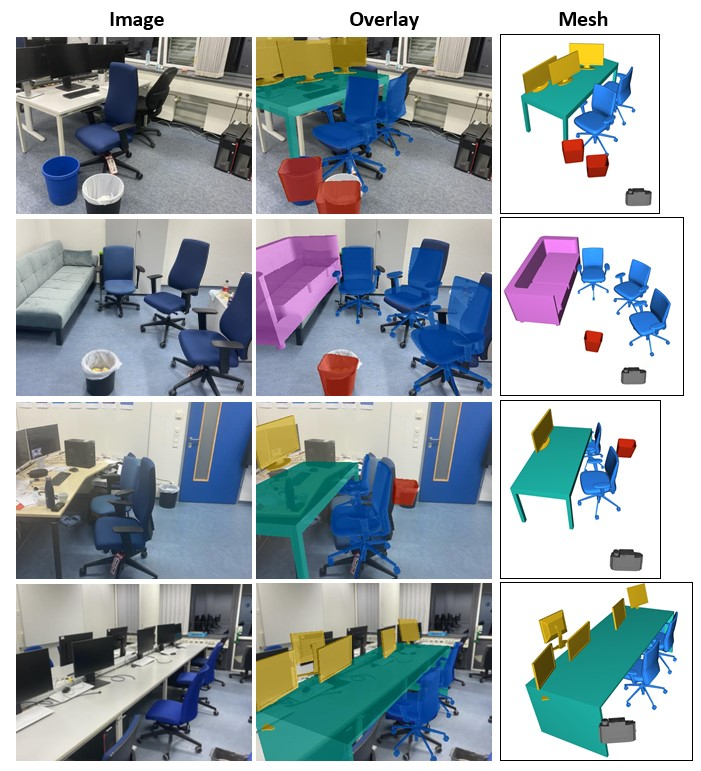

# ROCA: Robust CAD Model Alignment and Retrieval from a Single Image (CVPR 2022)
Code release of our paper [ROCA](https://niessnerlab.org/projects/guemeli2021roca.html).


If you find our paper or this repository helpful, please cite:
```
@article{gumeli2022roca,
  title={ROCA: Robust CAD Model Retrieval and Alignment from a Single Image},
  author={G{\"u}meli, Can and Dai, Angela and Nie{\ss}ner, Matthias},
  booktitle={Proc. Computer Vision and Pattern Recognition (CVPR), IEEE},
  year={2022}
}
```

## Development Environment
We use the following development environment for this project:
- Nvidia RTX 3090 GPU
- Intel Xeon W-1370
- Ubuntu 20.04
- CUDA Version 11.2
- cudatoolkit 11.0
- Pytorch 1.7
- Pytorch3D 0.5 or 0.6
- Detectron2 0.3

## Installation
This code is developed using anaconda3 with Python 3.8, therefore we recommend a similar setup.

You can simply run the following code in the command line to create the development environment:
```
$ source setup.sh
```

For visualizing some demo results or using the data preprocessing code, you need our custom rasterizer. In case the provided [x86-64 linux shared object](/renderer/scan2cad_rasterizer.cpython-38-x86_64-linux-gnu.so) does not work for you, you may install the rasterizer [here](https://github.com/cangumeli/Scan2CADRasterizer).

## Running the Demo


We provide four sample input images in `network/assets` folder. The images are captured with a smartphone and then preprocessed to be compatible with ROCA format. To run the demo, you first need to download data and config from this [Google Drive folder](https://drive.google.com/drive/folders/1ZOY50DjC85n06fTyYPc8feZiy9-fif3j?usp=sharing). `Models` folder contains the pre-trained model and used config, while `Data` folder contains images and dataset.

Assuming contents of the `Models` directory are in `$MODEL_DIR` and contents of the `Data` directory are in `$DATA_DIR`, you can run:
```
$ cd network
$ python demo.py --model_file $MODEL_DIR/model_best.pth --data_dir $DATA_DIR/Dataset --config_file $MODEL_DIR/config.yaml
```
You will see image overlay and CAD visualization are displayed one by one. Open3D mesh visualization is an interactive window where you can see geometries from different viewpoints.
Close the Open3D window to continue to the next visualization. You will see similar results to the image above.

For headless visualization, you can specify an output directory where resulting images and meshes are placed:
```
$ python demo.py --model_file $MODEL_DIR/model_best.pth --data_dir $DATA_DIR/Dataset --config_file $MODEL_DIR/config.yaml --output_folder $OUTPUT_DIR
```

You may use the `--wild` option to visualize results with "wild retrieval". Note that we omit the `table` category in this case due to large size diversity.

## Preparing Data
### Downloading Processed Data (Recommended)
We provide preprocessed images and labels in this [Google Drive folder](https://drive.google.com/drive/folders/1JbPidWsfcLyUswYQsulZN8HDFBTdoQog).  Download and extract all folders to a desired location before running the training and evaluation code.

### Rendering Data
Alternatively, you can render data yourself. Our data preparation code lives in the `renderer` folder.

Our project depends on [ShapeNet](https://shapenet.org/) (Chang et al., '15), [ScanNet](https://github.com/ScanNet/ScanNet) (Dai et al. '16), and [Scan2CAD](https://github.com/skanti/Scan2CAD) (Avetisyan et al. '18) datasets. For ScanNet, we use ScanNet25k images which are provided as a zip file via the ScanNet download script.

Once you get the data, check `renderer/env.sh` file for the locations of different datasets. The meanings of environment variables are described as inline comments in `env.sh`. 

After editing `renderer/env.sh`, run the data generation script:
```
$ cd renderer
$ sh run.sh
```

Please check `run.sh` to see how individual scripts are running for data preprocessing and feel free to customize the data pipeline!

## Training and Evaluating Models
Our training code lives in the `network` directory. Navigate to the `network/env.sh` and edit the environment variables. Make sure data directories are consistent with the ones locations downloaded and extracted folders. If you manually prepared data, make sure locations in `/network/env.sh` are consistent with the variables set in `renderer/env.sh`.

After you are done with `network/env.sh`, run the `run.sh` script to train a new model or evaluate an existing model based on the environment variables you set in `env.sh`:
```
$ cd network
$ sh run.sh
```

### Replicating Experiments from the Main Paper
Based on the configurations in `network/env.sh`, you can run different ablations from the paper. The default config will run the (final) experiment. You can do the following edits <b>cumulatively</b> for different experiments:

1. For P+E+W+R, set `RETRIEVAL_MODE=resnet_resnet+image`
2. For P+E+W, set `RETRIEVAL_MODE=nearest`
3. For P+E, set `NOC_WEIGHTS=0`
4. For P, set `E2E=0`

## Resources
To get the datasets and gain further insight regarding our implementation, we refer to the following datasets and open-source codebases:

### Datasets and Metadata
- https://shapenet.org/

- http://www.scan-net.org/

- https://github.com/skanti/Scan2CAD

### Libraries
- https://pytorch.org/

- https://github.com/facebookresearch/detectron2

- https://github.com/facebookresearch/pytorch3d

- http://www.open3d.org/

### Projects
- https://github.com/facebookresearch/meshrcnn

- https://github.com/xheon/JointEmbedding
